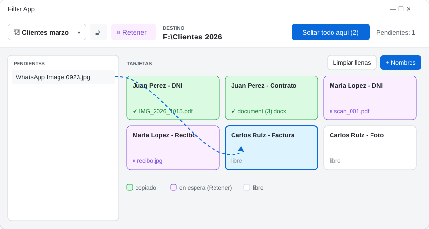
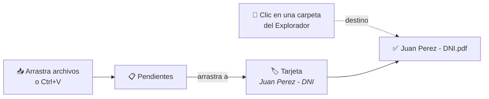
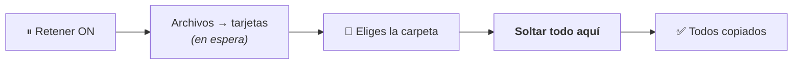
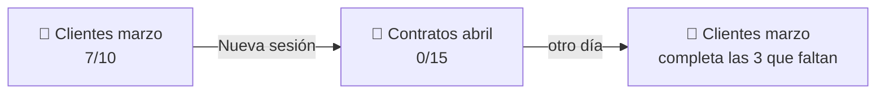

<p align="center">
  
</p>

<h1 align="center">Filter App</h1>

<p align="center">
  Arrastra un archivo a un nombre → se copia a tu carpeta <b>ya renombrado</b>.<br>
  <a href="https://github.com/1xmanMAX/filter-app/releases/latest/download/FilterApp-win-x64.zip"><b>⬇ Descargar para Windows</b></a>
</p>

<p align="center">
  
</p>

## Instalar

| 1 | 2 | 3 |
|:-:|:-:|:-:|
| Descarga el **ZIP** y descomprímelo | Doble clic en **`Instalar.cmd`** | Busca **Filter App** en Inicio 🔍 |

> No necesitas instalar nada más. Se añade al menú Inicio, al escritorio y a *Configuración › Aplicaciones* (desde ahí también se desinstala).
>
> Si Windows muestra *"Windows protegió su PC"*: **Más información → Ejecutar de todas formas**.

## Cómo se usa



1. **+ Nombres** → pega una lista de nombres (uno por línea). Cada uno es una tarjeta.
2. Haz clic en una carpeta del **Explorador**: ese es el destino.
3. Arrastra cada archivo a su tarjeta. Listo ✔

## Modo Retener ⏸

¿Aún no sabes la carpeta? Activa **Retener**: los archivos esperan en las tarjetas y se copian **todos juntos**.



## Sesiones 📂

¿Te faltaron archivos? No pasa nada: **todo se guarda solo**. Retómalo otro día.



Pulsa el botón **📂** (arriba a la izquierda) para crear, cambiar, renombrar o eliminar sesiones. Cada una guarda sus tarjetas, su destino y sus pendientes.

## Botones

| | |
|---|---|
| 📂 **Sesión** | Crear, cambiar, renombrar o eliminar sesiones (listas guardadas) |
| 🔓 / 🔒 | Destino automático (sigue al Explorador) / fijo |
| ⏸ **Retener** | Guarda los archivos en las tarjetas hasta pulsar **Soltar todo aquí** |
| ✕ en tarjeta verde | Deshacer: borra la copia y libera la tarjeta |
| ✕ en tarjeta lila | Devuelve el archivo a Pendientes |
| **Limpiar llenas** | Quita las tarjetas ya completadas |

**Acepta:** archivos del Explorador, Telegram, navegador, Outlook e imágenes copiadas.

**Nunca sobrescribe:** si el nombre existe, crea `Nombre (2).pdf`.

---

<details>
<summary>Para desarrolladores</summary>

WPF · .NET 10 · Windows 10/11

```bat
dotnet test tests\FilterApp.Core.Tests   :: pruebas
publish.cmd                              :: exe local (requiere .NET 10 Desktop Runtime)
release.cmd                              :: ZIP autocontenido para Releases
```

| Carpeta | Contenido |
|---|---|
| `src/FilterApp.Core` | Lógica: tarjetas, copia segura, estado |
| `src/FilterApp` | Ventana WPF, arrastrar/pegar, Explorador |
| `installer/` | `Instalar.cmd` / `Desinstalar.cmd` |

</details>
