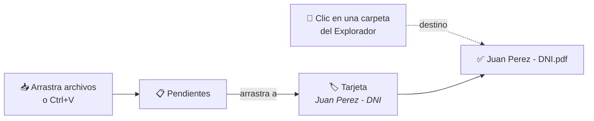
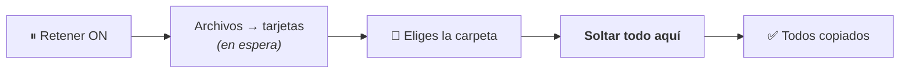
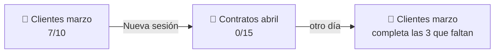
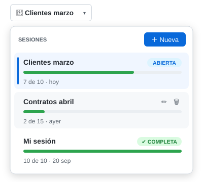

<p align="center">
  
</p>

<h1 align="center">Filter App</h1>

<p align="center">
  Arrastra un archivo a un nombre → se copia a tu carpeta <b>ya renombrado</b>.<br>
  <a href="https://github.com/1xmanMAX/filter-app/releases/latest/download/FilterApp-Setup.exe"><b>⬇ Descargar para Windows</b></a>
</p>

<p align="center">
  
</p>

## Instalar

| 1 | 2 | 3 |
|:-:|:-:|:-:|
| Descarga **`FilterApp-Setup.exe`** | Doble clic → **Siguiente** → **Instalar** | Busca **Filter App** en Inicio 🔍 |

> No necesitas instalar nada más ni permisos de administrador. Se añade al menú Inicio, al escritorio y a *Configuración › Aplicaciones* (desde ahí se desinstala). Para actualizar, instala la versión nueva encima: tus sesiones se conservan.
>
> Si Windows muestra *"Windows protegió su PC"*: **Más información → Ejecutar de todas formas**.
>
> ¿Sin instalador? Descarga el [ZIP](https://github.com/1xmanMAX/filter-app/releases/latest/download/FilterApp-win-x64.zip) y usa `Instalar.cmd`.

## Cómo se usa



1. **+ Nombres** → pega una lista de nombres (uno por línea). Cada uno es una tarjeta.
2. Haz clic en una carpeta del **Explorador**: ese es el destino.
3. Arrastra cada archivo a su tarjeta. Listo ✔

## Modo Retener ⏸

¿Aún no sabes la carpeta? Activa **Retener**: los archivos esperan en las tarjetas y se copian **todos juntos**.



## Sesiones 📂

¿Te faltaron archivos? No pasa nada: **todo se guarda solo**. Retómalo otro día.





Pulsa **📂** (arriba a la izquierda):

- **＋ Nueva** → escribe el nombre y Enter
- **Clic** en una sesión → la abre
- **✏️ / 🗑** → renombrar o eliminar
- La barra verde muestra cuánto falta

Cada sesión guarda sus tarjetas, su destino y sus pendientes.

<br clear="right">


## Vista previa 👁

Haz clic en un pendiente y míralo al instante, con su formato original y sin abrir otro programa:

| Tipo | Cómo se ve |
|---|---|
| PDF | Con PDFium (el motor de Chrome): página a página, en milisegundos aunque tenga cientos de páginas |
| Word | Al instante con su formato (títulos, listas, tablas con sus marcos, imágenes), aunque no tengas Office. Si Word puede, después pasa a su vista exacta |
| Excel, PowerPoint, Outlook… | Con la vista previa del Explorador (si tienes Office) |
| Páginas web (HTML, MHT) | Con el motor de Edge, con su diseño. Sin ejecutar su código ni conectarse a internet: seguro y rápido |
| Video y audio (MP4, MOV, MP3, WAV…) | Con el reproductor de Windows |
| Fotos (JPG, PNG, WEBP, HEIC…) | Bien orientadas. **Rueda** = zoom, **doble clic** = tamaño real |
| TXT, CSV, JSON, código | Como texto |
| Lo demás | Su miniatura + botón **Abrir** |

**Para moverte:** mantén pulsado el **botón central** (o el izquierdo en PDF e imágenes) y arrastra. **Ctrl + rueda** hace zoom en el PDF.
Doble clic en un archivo → se abre con su programa.

## Mini: bandeja rápida 📥

Pulsa **Mini** y la app se vuelve una ventanita que queda siempre encima de las demás. Suelta ahí archivos o carpetas enteras mientras trabajas: van a **Pendientes** para ordenarlos después. Muévela a donde quieras (recuerda su sitio); doble clic o ⤢ vuelve a la ventana completa.

## Carpetas y niveles 🗂️

Para reorganizar discos completos:

- **Suelta una carpeta entera** en Pendientes: entran todos sus archivos (con subcarpetas) y debajo de cada uno ves de qué carpeta viene.
- **Crea carpetas y nombres sin escribir símbolos:**
  - Fichas **＋ Nueva carpeta** / **＋ Nuevo nombre**: clic, escribe, **Enter** (y sigue con la siguiente). **Ctrl+Enter** crea la carpeta y entra.
  - **Suelta archivos sobre «＋ Nueva carpeta»**, escribe el nombre y Enter: se crea con los archivos dentro.
  - **+ Nombres** para muchas a la vez: **Tab** mete una línea dentro de la de arriba y esa se vuelve carpeta sola. A la derecha ves cómo quedará:
    ```
    Clientes
        Juan Perez
            DNI
            Contrato
    Facturas 2026
    ```
    Elige si las líneas sueltas son *nombres de archivo* o *carpetas*. Con **Copiar estructura de una carpeta…** repites un orden que ya tengas.
- **Clic en una carpeta** para entrar. La ruta de arriba (`Destino › Clientes › Juan`) te lleva de vuelta.
- **Suelta archivos en una carpeta**: entran con su nombre. **Mantenlos encima** y la carpeta se abre para ir más adentro.
- **Suelta una carpeta del Explorador sobre una carpeta**: entra entera, con sus subcarpetas.
- **Las carpetas son un primer filtro:** suelta todo en «Documentos», entra y desde ahí reparte. En **Archivos en esta carpeta** puedes arrastrar los archivos (uno o varios con Ctrl/Shift) a una subcarpeta, a un nombre (toman ese nombre), a «＋ Nueva carpeta» o a la ruta de arriba para subirlos de nivel. **F2** o ✏️ los renombra ahí mismo, y con el teclado basta escribir el destino y pulsar Enter.
- **Varios a la vez**: Ctrl o Shift + clic en Pendientes y arrastra.

### Con el teclado ⌨️

Selecciona un pendiente, **escribe** y pulsa **Enter**:

| Escribes | Pasa |
|---|---|
| `juan` | Busca carpetas y nombres en todo el árbol; Enter lo envía al primero |
| `Clientes/Juan/DNI` | Crea las carpetas que falten y lo guarda como `DNI.pdf` |
| `Clientes/Juan/` | Crea las carpetas y conserva el nombre del archivo |

Después se selecciona el siguiente pendiente. **Ctrl+Z** deshace, **Ctrl+F** va al buscador, **Retroceso** sube un nivel y **Supr** quita de Pendientes.

## Botones

| | |
|---|---|
| 📂 **Sesión** | Crear, cambiar, renombrar o eliminar sesiones (listas guardadas) |
| 🔓 / 🔒 | Destino automático (sigue al Explorador) / fijo |
| ⏸ **Retener** | Guarda los archivos en las tarjetas hasta pulsar **Soltar todo aquí** |
| 📄 **Copiar** / **Mover** | Copiar deja el original donde está. **Mover** lo saca de su carpeta (en el mismo disco es instantáneo) |
| 👁 **Vista previa** | Muestra u oculta el panel de vista previa |
| 📥 **Mini** | Bandeja rápida: ventanita siempre visible para soltar archivos |
| ↶ **Deshacer** | Deshace lo último (Ctrl+Z). Si se movió, el archivo vuelve a su sitio y a Pendientes |
| ✕ en tarjeta verde | Deshacer: quita el archivo y libera la tarjeta |
| ✕ en tarjeta lila | Devuelve el archivo a Pendientes |
| ✏️ / 🗑 en carpeta | Renombrar o quitar la carpeta de la lista (nunca se borra del disco) |
| **Limpiar llenas** | Quita de la lista lo ya colocado (los archivos se quedan) |

**Acepta:** archivos del Explorador, Telegram, navegador, Outlook e imágenes copiadas.

**Nunca sobrescribe:** si el nombre existe, crea `Nombre (2).pdf`.

---

<details>
<summary>Para desarrolladores</summary>

WPF · .NET 10 · Windows 10/11

```bat
dotnet test tests\FilterApp.Core.Tests   :: pruebas
publish.cmd                              :: exe local (requiere .NET 10 Desktop Runtime)
release.cmd                              :: ZIP autocontenido para Releases
```

| Carpeta | Contenido |
|---|---|
| `src/FilterApp.Core` | Lógica: tarjetas, copia segura, estado |
| `src/FilterApp` | Ventana WPF, arrastrar/pegar, Explorador |
| `installer/` | `Instalar.cmd` / `Desinstalar.cmd` |

</details>
