<p align="center">
  
</p>

<h1 align="center">Filter App</h1>

<p align="center">
  <b>Ordena tus archivos con solo arrastrarlos.</b><br>
  Míralos sin abrirlos, suéltalos en su carpeta y quedan guardados <b>con el nombre correcto</b>.
</p>

<p align="center">
  <a href="https://github.com/1xmanMAX/filter-app/releases/latest"></a>
  
  
  
</p>

<p align="center">
  <a href="https://github.com/1xmanMAX/filter-app/releases/latest/download/FilterApp-Setup.exe">
    
  </a>
  <br>
  <sub>Instalador de un clic · sin permisos de administrador · <a href="#instalar">¿cómo se instala?</a></sub>
</p>

<p align="center">
  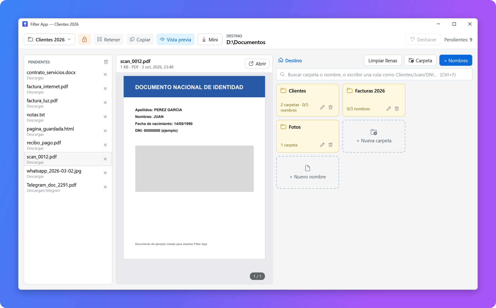
</p>

<p align="center">
  <a href="#instalar">Instalar</a> ·
  <a href="#ejemplo-1-los-papeles-de-tus-clientes">Primer ejemplo</a> ·
  <a href="#vista-previa-mira-antes-de-ordenar">Funciones</a> ·
  <a href="#consejos-para-ir-más-rápido">Consejos</a> ·
  <a href="#atajos-de-teclado">Atajos</a> ·
  <a href="#preguntas-frecuentes">Preguntas</a>
</p>

---

## ¿Qué hace?

¿Tienes la carpeta *Descargas* llena de *scan_0012.pdf*, *IMG_2041.jpg* o *Telegram_doc_2291.pdf*? Con Filter App los **miras**, los **arrastras** a su sitio y quedan **guardados y renombrados**: *Clientes › Juan Pérez › DNI.pdf*.

<table>
  <tr>
    <td width="50%" valign="top">
      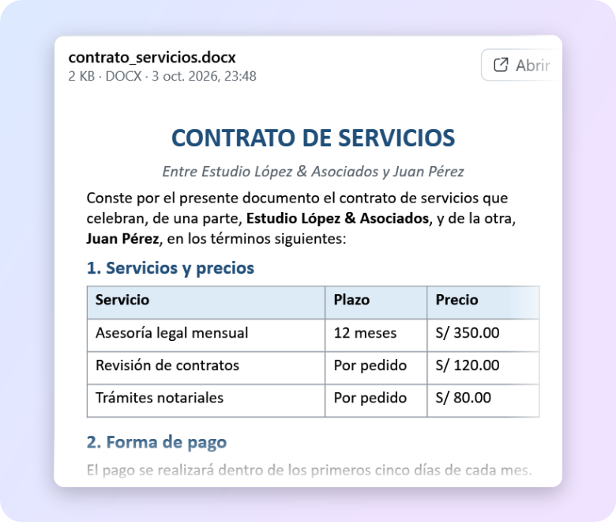<br>
      <b>👁️ Míralo sin abrirlo</b><br>
      PDF, Word, fotos, videos y páginas web se ven al instante, con su formato y sin abrir otros programas.
    </td>
    <td width="50%" valign="top">
      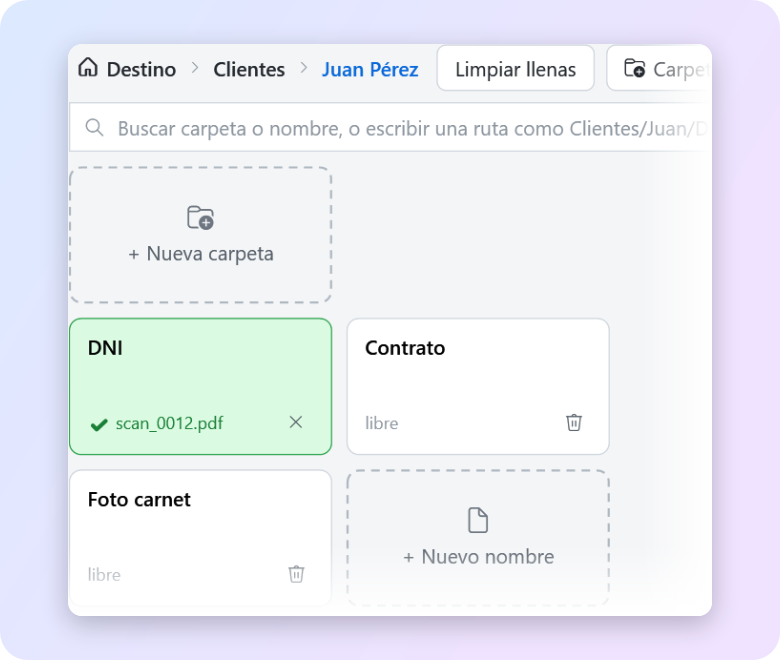<br>
      <b>🏷️ Se guarda ya renombrado</b><br>
      Suéltalo sobre «DNI» y queda como <i>DNI.pdf</i> en la carpeta correcta. Carpetas dentro de carpetas, sin límite.
    </td>
  </tr>
  <tr>
    <td width="50%" valign="top">
      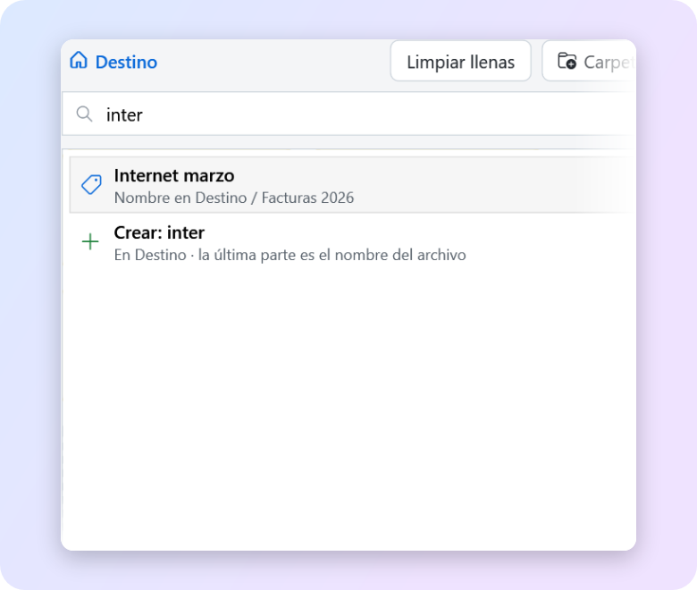<br>
      <b>⌨️ Con el teclado</b><br>
      Escribe tres letras, pulsa Enter y pasa solo al siguiente archivo. Decenas de archivos sin tocar el ratón.
    </td>
    <td width="50%" valign="top">
      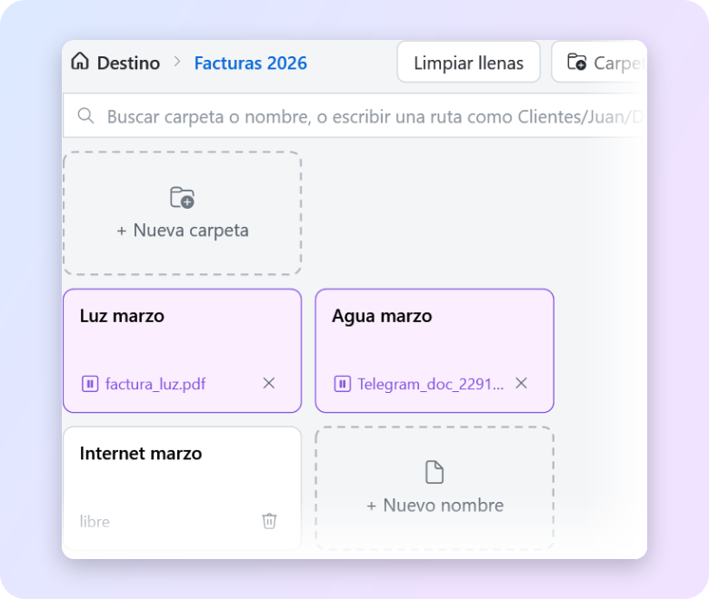<br>
      <b>⏸️ Decide al final</b><br>
      Pon los nombres ahora y elige la carpeta del disco cuando termines. Se guardan todos de una vez.
    </td>
  </tr>
  <tr>
    <td width="50%" valign="top">
      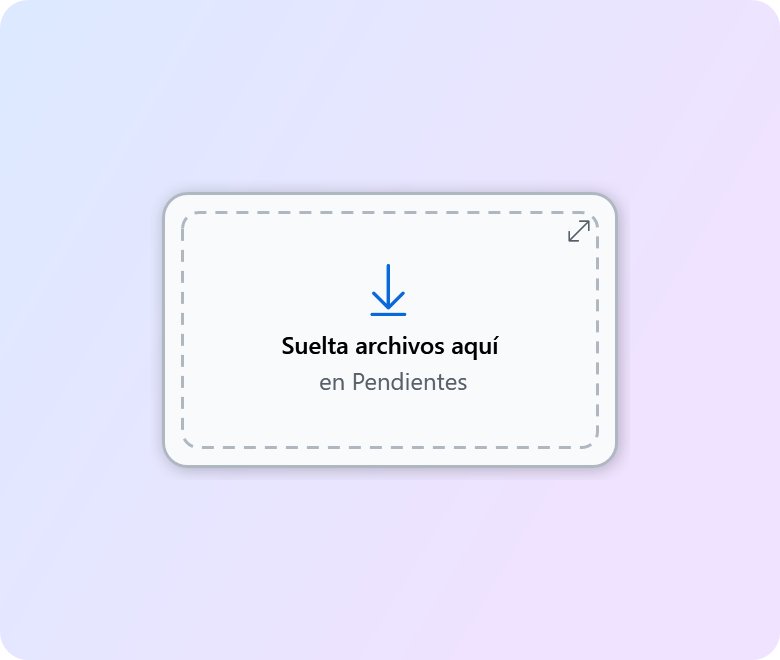<br>
      <b>🪟 Ventana Mini</b><br>
      Una bandeja pequeña, siempre a la vista, para soltar lo que te llegue durante el día.
    </td>
    <td width="50%" valign="top">
      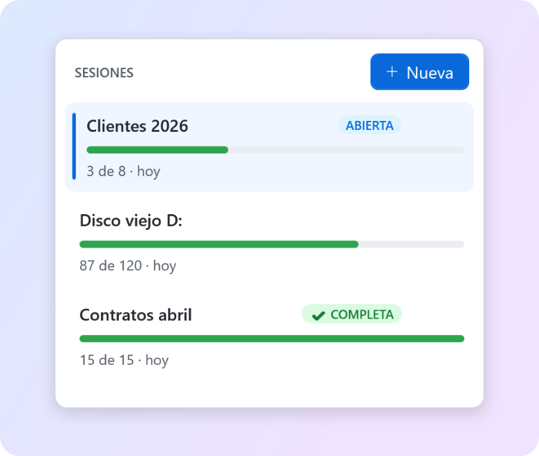<br>
      <b>💾 Sigue otro día</b><br>
      Todo se guarda solo. Ten varios trabajos a medias y mira cuánto te falta en cada uno.
    </td>
  </tr>
</table>

<p align="center">
  ✂️ <b>Copia o mueve</b> &nbsp;·&nbsp; 📦 <b>Carpetas enteras de golpe</b> &nbsp;·&nbsp; ↩️ <b>Ctrl+Z deshace</b> &nbsp;·&nbsp; 🛡️ <b>Nunca sobrescribe ni borra</b>
</p>

---

## Instalar

1. **Descarga** [FilterApp-Setup.exe](https://github.com/1xmanMAX/filter-app/releases/latest/download/FilterApp-Setup.exe).
2. **Ábrelo** con doble clic y pulsa **Siguiente → Instalar**.
3. **Búscalo** en el menú Inicio: *Filter App*.

> [!TIP]
> No pide permisos de administrador. Para **actualizar**, instala la versión nueva encima: tus sesiones se conservan.

> [!NOTE]
> Si aparece **«Windows protegió su PC»**, pulsa **Más información → Ejecutar de todas formas**. Sale porque la app es nueva y Windows aún no la conoce.

<details>
<summary>Otras formas de instalar y cómo desinstalar</summary>

- **Sin instalador:** descarga el [ZIP](https://github.com/1xmanMAX/filter-app/releases/latest/download/FilterApp-win-x64.zip), descomprímelo y haz doble clic en *Instalar.cmd*.
- **Desinstalar:** *Configuración › Aplicaciones › Filter App › Desinstalar*.
</details>

---

## La ventana en 30 segundos

<p align="center">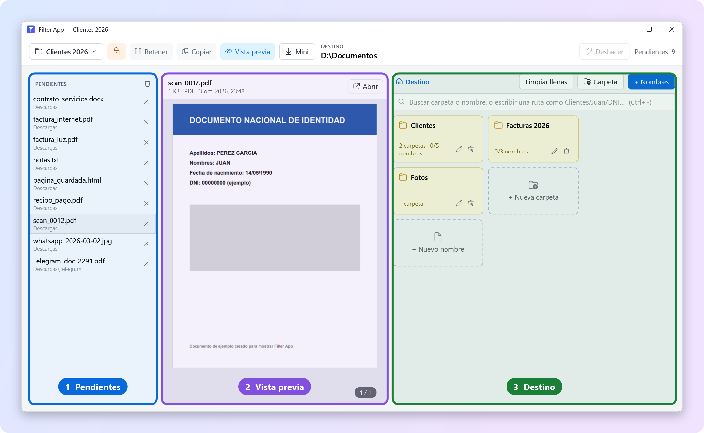</p>

Los archivos viajan **de izquierda a derecha**:

1. **Pendientes:** lo que falta ordenar. Suelta aquí archivos o carpetas enteras.
2. **Vista previa:** haz clic en un pendiente y míralo aquí.
3. **Destino:** tus carpetas 📁 (amarillas) y nombres 🏷️ (blancos). Arrastra el archivo encima y listo.

**¿Dónde se guarda todo?** En la carpeta **DESTINO** que ves arriba (por ejemplo *D:\Documentos*). Para elegirla, **ábrela en el Explorador de Windows** y Filter App la detecta sola. Pulsa el candado 🔒 para que no cambie mientras trabajas.

---

## Ejemplo 1: los papeles de tus clientes

**La situación:** en *Descargas* tienes escaneos, fotos de WhatsApp, recibos y un contrato en Word. Quieres dejarlos así:

```text
D:\Documentos
├── Clientes
│   ├── Juan Pérez
│   │   ├── DNI.pdf
│   │   ├── Contrato.docx
│   │   └── Foto carnet.jpg
│   └── Ana López
│       ├── DNI.pdf
│       └── Contrato.docx
└── Facturas 2026
    ├── Luz marzo.pdf
    ├── Agua marzo.pdf
    └── Internet marzo.pdf
```

### Paso 1 · Elige el destino

Abre *D:\Documentos* en el Explorador de Windows. Arriba en Filter App verás **DESTINO D:\Documentos**. Pulsa 🔒 para que no cambie mientras trabajas.

### Paso 2 · Escribe la estructura

Pulsa **+ Nombres** y escribe tu lista, una línea por carpeta o nombre. Pulsa **Tab** para meter una línea dentro de la de arriba: si una línea tiene otras dentro, se convierte en carpeta automáticamente. A la derecha ves cómo quedará:

<p align="center">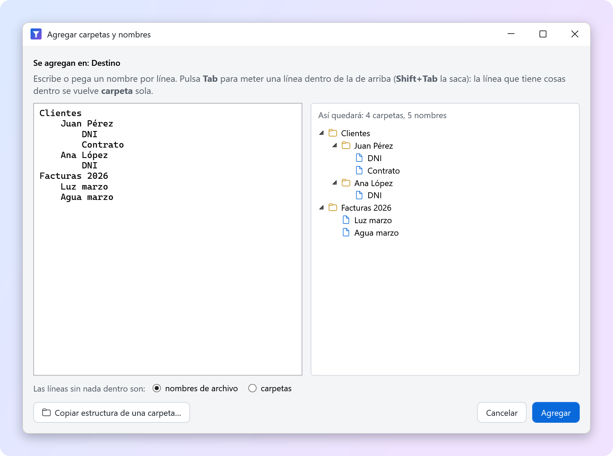</p>

Pulsa **Agregar**. Aparecen las carpetas **Clientes** y **Facturas 2026**.

### Paso 3 · Trae los archivos

Arrastra los archivos, o la carpeta *Descargas* entera, a **Pendientes**. También puedes copiarlos en el Explorador y pulsar **Ctrl+V**, o arrastrarlos desde Telegram, el navegador u Outlook.

### Paso 4 · Mira y suelta

Haz clic en *scan_0012.pdf*: en la vista previa ves que es el DNI de Juan. Entra en **Clientes › Juan Pérez** y suéltalo sobre la ficha **DNI**:

<p align="center">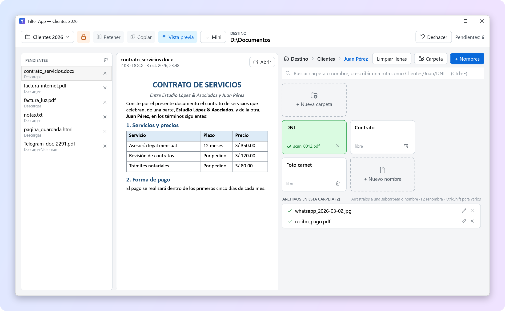</p>

- La ficha **DNI** se pone **verde ✔**: el archivo ya está en *D:\Documentos\Clientes\Juan Pérez\DNI.pdf*.
- Lo que sueltas **sobre la carpeta** (no sobre un nombre) entra con su nombre original. Lo ves abajo, en **Archivos en esta carpeta**.
- La ruta de arriba (*Destino › Clientes › Juan Pérez*) te devuelve a cualquier nivel con un clic.

### Paso 5 · Repite hasta vaciar Pendientes

Cada archivo que colocas **sale de Pendientes**. El contador de arriba te dice cuánto falta y cada carpeta muestra su avance (*1/5 nombres · 2 archivos*). Cuando **Pendientes** llegue a 0, ¡listo! 🎉

---

## Vista previa: mira antes de ordenar

Haz clic en cualquier archivo y lo ves al instante, **tal como es**, sin abrir otro programa.

| Archivo | Cómo se ve |
|---|---|
| 📄 **PDF** | Página a página, al instante aunque tenga cientos de páginas |
| 📝 **Word** | Con títulos, colores, listas, tablas con sus marcos e imágenes, **aunque no tengas Office** |
| 📊 **Excel, PowerPoint, Outlook** | Con la vista previa de Windows (necesita Office) |
| 🌐 **Páginas web guardadas** | Con su diseño, sin conectarse a internet |
| 🖼️ **Fotos** | Bien orientadas, con zoom |
| 🎬 **Videos y música** | Se reproducen ahí mismo |
| 🗒️ **Notas y texto** | Como texto |
| ❔ **Otros** | Su miniatura y el botón **Abrir** |

<p align="center">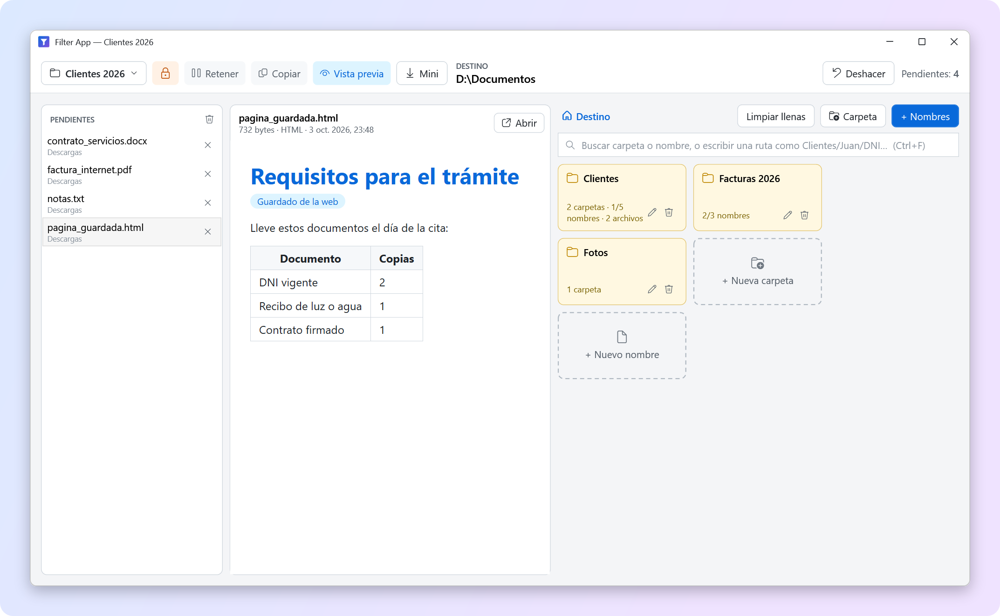</p>

> [!TIP]
> **Para moverte:** mantén pulsada la **rueda del ratón** y arrastra (en PDF y fotos también vale el botón izquierdo). **Ctrl + rueda** hace zoom en los PDF y la **rueda** en las fotos. **Doble clic** en un archivo de la lista lo abre con su programa.

---

## Carpetas y nombres

En el destino hay **dos tipos de fichas**:

| Ficha | Cómo es | Qué pasa al soltar un archivo |
|---|---|---|
| 📁 **Carpeta** | Amarilla | Entra con **su nombre original** (*whatsapp_2026-03-02.jpg*) |
| 🏷️ **Nombre** | Blanca, dice *libre* | Toma **ese nombre** (*DNI.pdf*) y la ficha se pone verde ✔ |

La extensión se conserva siempre: una foto soltada en *Foto carnet* queda como *Foto carnet.jpg*.

**Tres formas de crear carpetas y nombres, sin escribir barras:**

1. **Las fichas punteadas** «＋ Nueva carpeta» y «＋ Nuevo nombre»: clic, escribe y **Enter**. Puedes seguir con la siguiente. **Ctrl+Enter** crea la carpeta y entra en ella.
2. **Suelta archivos sobre «＋ Nueva carpeta»**, escribe el nombre y pulsa Enter: se crea la carpeta con ellos dentro.
3. **+ Nombres** para muchos a la vez, con sangrías, como en el [paso 2](#paso-2--escribe-la-estructura). Debajo eliges si las líneas sueltas son *nombres de archivo* o *carpetas*. **Copiar estructura de una carpeta…** repite el orden de una carpeta que ya tengas.

Las carpetas solo se crean en el disco cuando reciben su primer archivo: nada de carpetas vacías. El lápiz ✏️ renombra una carpeta y la papelera 🗑 la quita de la lista (**nunca se borra del disco**).

---

## Las carpetas como filtro

No hace falta decidirlo todo de una vez. Ordena **por pasadas**:

<p align="center">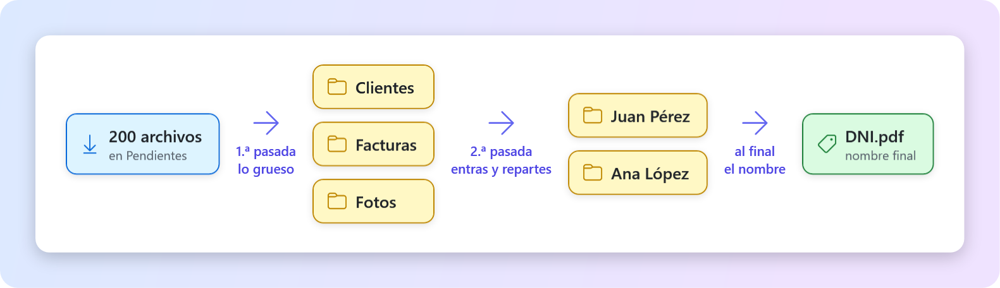</p>

1. **1.ª pasada:** suelta todo lo de clientes en **Clientes**, sin pensar más. Selecciona varios con **Ctrl** o **Shift** + clic y arrástralos juntos.
2. **2.ª pasada:** entra en **Clientes**. Abajo, en **Archivos en esta carpeta**, está todo lo que soltaste. Arrástralo a una subcarpeta o a un nombre.

> [!TIP]
> Mientras arrastras, **mantén el archivo un momento sobre una carpeta** y se abrirá sola para que bajes de nivel sin soltarlo.

<details>
<summary>Más cosas que puedes hacer en «Archivos en esta carpeta»</summary>

- Arrastrarlos a **Destino**, en la ruta de arriba, para subirlos de nivel.
- Soltarlos en «＋ Nueva carpeta» para crear una carpeta con ellos dentro.
- **F2** o ✏️: cambiar el nombre sin moverlos.
- **✕**: devolverlos a Pendientes. Si los habías movido, también vuelven a su sitio original.
</details>

---

## La barra rápida: ordenar con el teclado

Selecciona un pendiente, **empieza a escribir** y pulsa **Enter**.

<p align="center">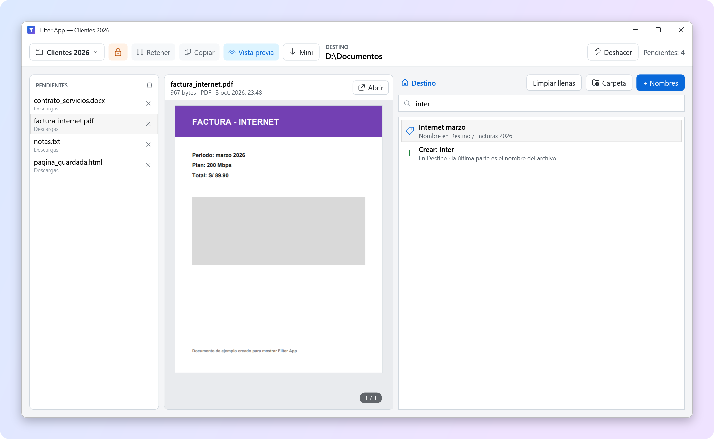</p>

| Escribes | Qué pasa |
|---|---|
| **inter** | Busca en todas las carpetas y nombres. **Enter** lo envía al primero (*Internet marzo*) |
| **Clientes/Juan Pérez/DNI** | Crea las carpetas que falten y lo guarda como *DNI.pdf* |
| **Clientes/Juan Pérez/** | Crea las carpetas y deja el nombre original |

Después se selecciona solo el siguiente pendiente: *escribir → Enter → escribir → Enter…* También funciona dentro de una carpeta, con los archivos seleccionados en **Archivos en esta carpeta**.

---

## Copiar o mover

El botón **Copiar / Mover** de arriba decide qué pasa con el archivo original:

<p align="center">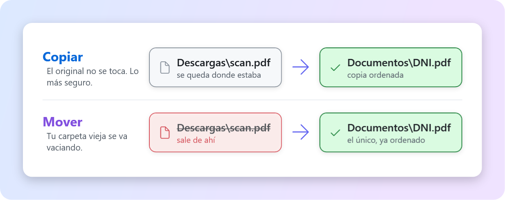</p>

- **Copiar** (lo normal) es lo más seguro: el original no se toca.
- **Mover** vacía tu carpeta vieja a medida que ordenas. En el mismo disco es instantáneo, aunque sean archivos de varios GB.
- Si deshaces un archivo movido, **vuelve a su carpeta original**.

---

## Retener: decidir la carpeta al final

¿Sabes qué nombre lleva cada archivo, pero todavía no en qué carpeta va? Activa **Retener**: los archivos **esperan** en las fichas (en lila) y no se guardan todavía.

<p align="center">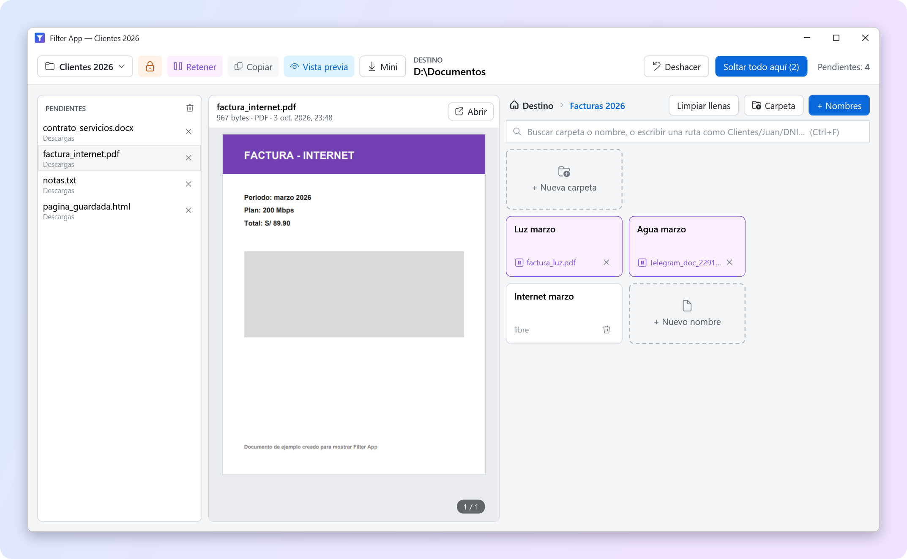</p>

Cuando decidas, abre la carpeta en el Explorador y pulsa **Soltar todo aquí**: se guardan todos de una vez. La **✕** de una ficha lila devuelve su archivo a Pendientes.

---

## Mini: la bandeja rápida

<p align="center">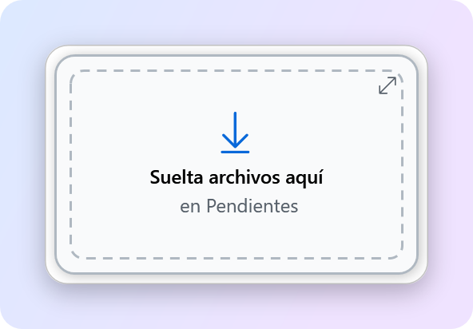</p>

Pulsa **Mini** y Filter App se vuelve una **ventanita que queda siempre encima** de las demás. Mientras trabajas en otra cosa, suelta ahí lo que vaya llegando: archivos o carpetas enteras. Todo va a **Pendientes** para ordenarlo después con calma.

Muévela a donde quieras (recuerda su sitio). **Doble clic** o ⤢ vuelve a la ventana completa.

---

## Sesiones: continúa otro día

<p align="center">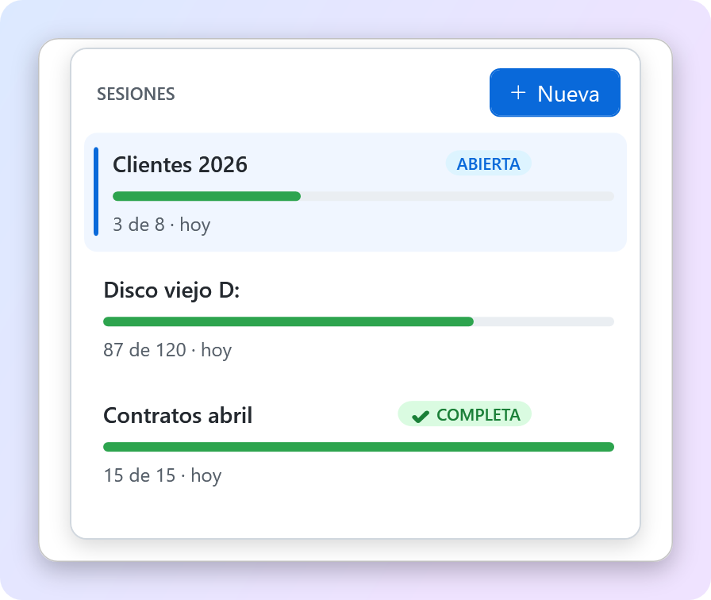</p>

**Todo se guarda solo.** Cada *sesión* es un trabajo distinto, con sus carpetas, nombres, destino y pendientes. Pulsa el botón de la sesión (arriba a la izquierda) para:

- **＋ Nueva:** escribe el nombre y pulsa Enter.
- **Abrir otra:** un clic en ella.
- **Renombrar o eliminar:** ✏️ y 🗑.

La barra verde muestra cuánto falta (*87 de 120*), y dice **COMPLETA** cuando terminas.

---

## Ejemplo 2: reorganizar un disco entero

**La situación:** un disco viejo con años de carpetas mezcladas (*Nueva carpeta (3)*, *Escritorio viejo*, *Fotos celular*…). Quieres dejarlo así:

```text
E:\Ordenado
├── Documentos personales
├── Trabajo
│   ├── 2024
│   └── 2025
├── Fotos
│   ├── Familia
│   └── Viajes
└── Música
```

1. **Crea una sesión** «Disco viejo»: podrás dejarlo a medias y seguir otro día.
2. **Activa Mover**: el disco viejo se irá vaciando y verás lo que falta.
3. **Elige el destino** *E:\Ordenado* en el Explorador y pulsa 🔒.
4. **+ Nombres** con la estructura de arriba, marcando que las líneas sueltas son **carpetas**. Si ya tienes un disco ordenado así, usa **Copiar estructura de una carpeta…**
5. **Suelta las carpetas del disco viejo en Pendientes.** Entran todos sus archivos, con subcarpetas incluidas, y debajo de cada uno ves de qué carpeta viene.
6. **1.ª pasada:** reparte en *Fotos*, *Trabajo*, *Música*… Si una carpeta vieja ya está bien ordenada, **suéltala desde el Explorador sobre una carpeta del destino** y entra completa.
7. **2.ª pasada:** entra en cada carpeta y reparte desde **Archivos en esta carpeta** (de *Fotos* a *Familia* o *Viajes*).
8. ¿Te equivocaste? **Ctrl+Z**: con Mover, el archivo vuelve a su sitio en el disco viejo.

---

## Consejos para ir más rápido

1. **Fija el destino 🔒 antes de empezar.** Aunque abras otras carpetas en el Explorador, todo irá al mismo sitio.
2. **Escribe primero la estructura con + Nombres.** Cinco minutos de lista ahorran horas de arrastrar.
3. **Una sesión por trabajo:** «Clientes 2026», «Disco viejo», «Papeles del auto».
4. **De lo grueso a lo fino.** Con cientos de archivos, primero a 3 o 4 carpetas grandes; después entra en cada una y reparte.
5. **Tres letras + Enter.** Escribir *dni* o *luz* es más rápido que arrastrar, y pasa solo al siguiente.
6. **¿Nombre o carpeta?** Usa un *nombre* cuando el archivo debe llamarse de una forma fija (*DNI*, *Contrato*). Usa una *carpeta* cuando importa más dónde está que cómo se llama (fotos, recibos).
7. **¿Dudas? Empieza con Copiar.** Cuando te sientas seguro, cambia a **Mover** para que la carpeta vieja se vaya vaciando.
8. **Deja la ventana Mini en una esquina** y suelta ahí lo que te llegue por correo o Telegram.

---

## Atajos de teclado

| Tecla | Qué hace |
|---|---|
| *Escribir* + **Enter** | Envía el archivo al primer resultado de la barra rápida |
| **Ctrl+F** | Ir a la barra rápida |
| **Ctrl+V** | Pegar en Pendientes archivos o imágenes copiadas |
| **Ctrl+Z** | Deshacer lo último |
| **Ctrl / Shift + clic** | Seleccionar varios |
| **Retroceso** | Subir un nivel de carpeta |
| **Supr** | Quitar de Pendientes |
| **F2** | Renombrar un archivo dentro de la carpeta |
| **Tab / Shift+Tab** | En **+ Nombres**: meter o sacar una línea |
| **Ctrl+Enter** | En «＋ Nueva carpeta»: crearla y entrar |

---

## Tus archivos están seguros

- **Deshacer:** **Ctrl+Z** deshace lo último. Si el archivo se había movido, vuelve a su carpeta original y a Pendientes.
- **Nunca sobrescribe:** si *DNI.pdf* ya existe, guarda *DNI (2).pdf*.
- **Nunca deja archivos a medias:** aunque se vaya la luz mientras copia.
- **Quitar no es borrar:** la papelera, la ✕ y **Limpiar llenas** solo quitan cosas **de la lista**. Tus archivos del disco no se tocan.
- **Al mover entre discos**, primero copia y solo borra el original cuando la copia ha terminado bien.

---

## Preguntas frecuentes

<details>
<summary><b>¿Puede borrar mis archivos?</b></summary>

No. Filter App nunca borra ni sobrescribe. En modo **Mover** el original sale de su carpeta, pero solo después de que el archivo haya llegado bien a su destino, y **Ctrl+Z** lo devuelve.
</details>

<details>
<summary><b>Un Word o un Excel no se ve en la vista previa</b></summary>

Los Word (.docx) se ven siempre, aunque no tengas Office. Excel, PowerPoint y los Word antiguos (.doc) usan la vista previa de Office: si no está instalado, verás su miniatura. Pulsa **Abrir** para verlo con su programa.
</details>

<details>
<summary><b>¿Por qué una página web se ve sin algunas imágenes?</b></summary>

Para que sea rápida y segura, la vista previa no se conecta a internet ni ejecuta nada de la página. Las imágenes guardadas junto al archivo sí se ven; las que están en internet, no.
</details>

<details>
<summary><b>Cerré la app sin terminar, ¿perdí el trabajo?</b></summary>

No. Todo se guarda solo: al abrirla sigues donde lo dejaste. Con **Sesiones** puedes tener varios trabajos a medias.
</details>

<details>
<summary><b>¿Se crean carpetas vacías en mi disco?</b></summary>

No. Las carpetas que escribes en Filter App se crean en el disco solo cuando les metes el primer archivo.
</details>

<details>
<summary><b>Arrastré un archivo al sitio equivocado</b></summary>

**Ctrl+Z**, o la **✕** de la ficha. Si estaba dentro de una carpeta, búscalo en **Archivos en esta carpeta** y arrástralo a donde iba.
</details>

---

<p align="center"><sub>Las capturas de esta página se hicieron con archivos de ejemplo inventados · ¿Quieres compilarla o colaborar? Mira <a href="docs/DESARROLLO.md">docs/DESARROLLO.md</a></sub></p>
