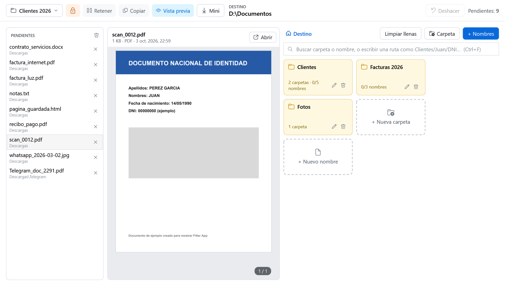
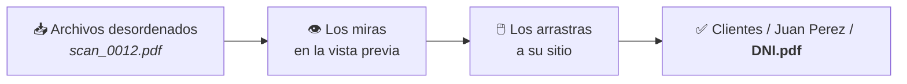
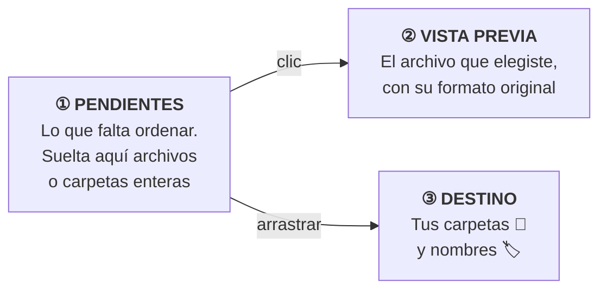
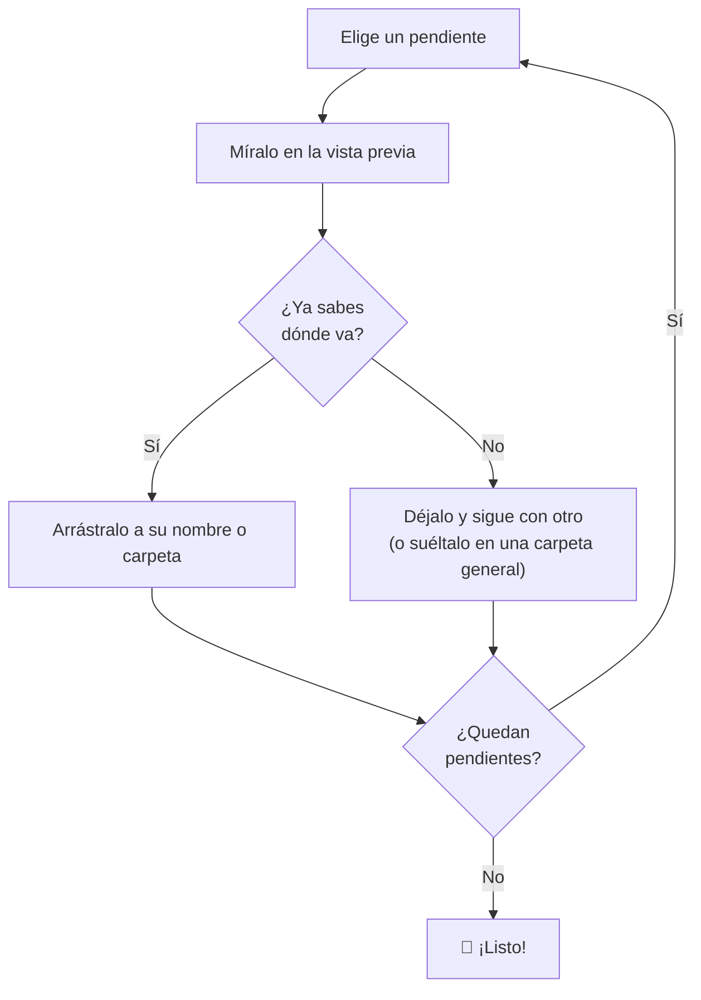
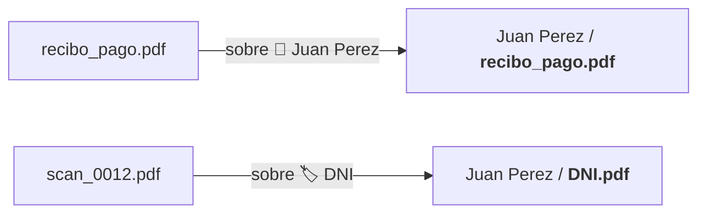
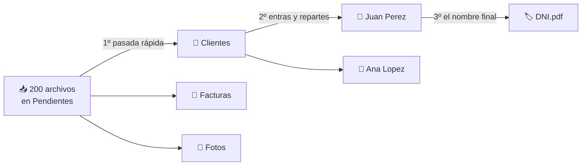
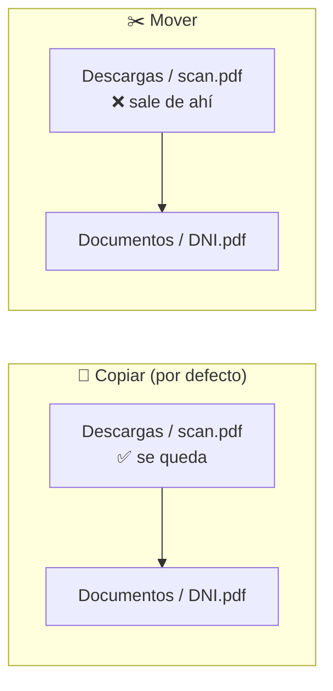
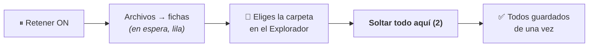
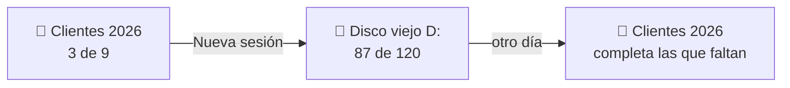
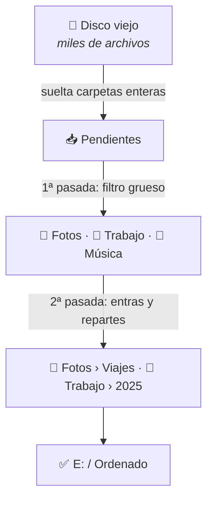

<p align="center">
  
</p>

<h1 align="center">Filter App</h1>

<p align="center">
  <b>Ordena tus archivos arrastrándolos.</b> Míralos sin abrir otro programa, suéltalos en su carpeta y quedan <b>ya renombrados</b>.<br><br>
  <a href="https://github.com/1xmanMAX/filter-app/releases/latest/download/FilterApp-Setup.exe"><b>⬇ Descargar para Windows</b></a>
</p>

<p align="center">
  
</p>

---

## ¿Para qué sirve?

¿Tienes la carpeta *Descargas* llena de `scan_0012.pdf`, `IMG_2041.jpg` o `Telegram_doc_2291.pdf`? Filter App te ayuda a ponerlos en orden:



- **Ves cada archivo al instante**: PDF, Word, fotos, videos, páginas web… sin abrir otros programas.
- **Lo arrastras a un nombre** (por ejemplo *DNI*) y se guarda como `DNI.pdf` en la carpeta correcta.
- **Creas carpetas sobre la marcha**, con todos los niveles que quieras.
- **Nunca pierdes nada**: no sobrescribe archivos y todo se puede deshacer.

## Contenido

1. [Instalar](#instalar)
2. [La ventana en 30 segundos](#la-ventana-en-30-segundos)
3. [Ejemplo completo: ordenar los papeles de tus clientes](#ejemplo-completo-ordenar-los-papeles-de-tus-clientes)
4. [Vista previa: mira antes de ordenar](#vista-previa-mira-antes-de-ordenar)
5. [Carpetas y nombres](#carpetas-y-nombres)
6. [Las carpetas como filtro](#las-carpetas-como-filtro)
7. [La barra rápida: ordenar con el teclado](#la-barra-rápida-ordenar-con-el-teclado)
8. [Copiar o mover](#copiar-o-mover)
9. [Retener: decidir la carpeta al final](#retener-decidir-la-carpeta-al-final)
10. [Mini: la bandeja rápida](#mini-la-bandeja-rápida)
11. [Sesiones: continúa otro día](#sesiones-continúa-otro-día)
12. [Ejemplo 2: reorganizar un disco entero](#ejemplo-2-reorganizar-un-disco-entero)
13. [Deshacer y seguridad](#deshacer-y-seguridad)
14. [Atajos de teclado y botones](#atajos-de-teclado-y-botones)
15. [Preguntas frecuentes](#preguntas-frecuentes)

---

## Instalar

| 1 | 2 | 3 |
|:-:|:-:|:-:|
| Descarga **`FilterApp-Setup.exe`** | Doble clic → **Siguiente** → **Instalar** | Busca **Filter App** en Inicio 🔍 |

> No necesitas instalar nada más ni permisos de administrador. Se añade al menú Inicio, al escritorio y a *Configuración › Aplicaciones* (desde ahí se desinstala). Para actualizar, instala la versión nueva encima: tus sesiones se conservan.
>
> Si Windows muestra *"Windows protegió su PC"*: **Más información → Ejecutar de todas formas**.
>
> ¿Sin instalador? Descarga el [ZIP](https://github.com/1xmanMAX/filter-app/releases/latest/download/FilterApp-win-x64.zip) y usa `Instalar.cmd`.

---

## La ventana en 30 segundos

La ventana tiene **tres columnas**. Los archivos viajan de izquierda a derecha:



| Zona | Qué hay | Qué haces ahí |
|---|---|---|
| **Barra de arriba** | Sesión, Retener, Copiar/Mover, Vista previa, Mini, carpeta **DESTINO**, Deshacer | Eliges cómo trabajar y **dónde** se guarda todo |
| **① Pendientes** | Los archivos por ordenar. Debajo de cada uno, de qué carpeta viene | Suelta archivos aquí. Clic para verlo. Arrastra para ordenarlo |
| **② Vista previa** | El archivo seleccionado | Lo lees, haces zoom y te desplazas. **Abrir** lo abre con su programa |
| **③ Destino** | Carpetas 📁 (amarillas) y nombres 🏷️ (blancos) | Suelta los archivos encima. Clic en una carpeta para entrar |

**El destino** es la carpeta de tu PC donde se guarda todo (arriba, por ejemplo `D:\Documentos`). Para elegirla, **abre esa carpeta en el Explorador de Windows**: Filter App la detecta sola. El candado 🔓/🔒 decide si sigue al Explorador o se queda fija.

---

## Ejemplo completo: ordenar los papeles de tus clientes

**La situación:** tienes en *Descargas* escaneos, fotos de WhatsApp, recibos y un contrato en Word. Quieres esto:

```
D:\Documentos
├── Clientes
│   ├── Juan Perez
│   │   ├── DNI.pdf
│   │   ├── Contrato.docx
│   │   └── Foto carnet.jpg
│   └── Ana Lopez
│       ├── DNI.pdf
│       └── Contrato.docx
└── Facturas 2026
    ├── Luz marzo.pdf
    ├── Agua marzo.pdf
    └── Internet marzo.pdf
```

### Paso 1 · Elige el destino

Abre `D:\Documentos` en el Explorador de Windows. Arriba en Filter App verás **DESTINO D:\Documentos**. Pulsa 🔒 para que no cambie mientras trabajas.

### Paso 2 · Escribe la estructura

Pulsa **+ Nombres** y escribe tu lista. **Tab** mete una línea dentro de la de arriba, y la línea que tiene cosas dentro se vuelve carpeta sola. A la derecha ves cómo quedará:

<p align="center"></p>

Pulsa **Agregar**. Aparecen las carpetas **Clientes** y **Facturas 2026**. Las carpetas solo se crean en el disco cuando metes el primer archivo, así que no se llena de carpetas vacías.

### Paso 3 · Trae los archivos

Arrastra los archivos (o la carpeta *Descargas* entera) a **Pendientes**. También vale **Ctrl+V** después de copiar en el Explorador, y arrastrar desde Telegram, el navegador o Outlook.

### Paso 4 · Mira y suelta

Haz clic en `scan_0012.pdf`: en la vista previa ves que es el DNI de Juan. Entra en **Clientes › Juan Perez** y suéltalo sobre la ficha **DNI**:

<p align="center"></p>

- La ficha **DNI** se pone **verde ✔**: el archivo ya está en `D:\Documentos\Clientes\Juan Perez\DNI.pdf`.
- Lo que sueltas **sobre la carpeta** (no sobre un nombre) entra con su nombre original. Lo ves abajo, en **Archivos en esta carpeta**.
- La ruta de arriba (`Destino › Clientes › Juan Perez`) te devuelve a cualquier nivel con un clic.

### Paso 5 · Repite hasta vaciar Pendientes

Cada archivo que colocas **sale de Pendientes**. El contador de arriba (*Pendientes: 6*) te dice cuánto falta, y en cada carpeta ves el avance (*1/5 nombres · 2 archivos*).



---

## Vista previa: mira antes de ordenar

Haz clic en cualquier archivo y lo ves al instante, **con su formato original**, sin abrir otro programa:

| Tipo | Cómo se ve |
|---|---|
| **PDF** | Con PDFium (el motor de Chrome): página a página, en milisegundos aunque tenga cientos de páginas |
| **Word** (.docx) | Al instante con su formato: títulos, negritas, colores, listas, **tablas con sus marcos** e imágenes, aunque no tengas Office. Si tienes Word, después pasa a su vista exacta |
| **Excel, PowerPoint, Outlook…** | Con la vista previa de Windows (necesita Office) |
| **Páginas web** (HTML, MHT) | Con su diseño. No ejecuta su código ni se conecta a internet: es seguro y rápido |
| **Fotos** (JPG, PNG, WEBP, HEIC…) | Bien orientadas. **Rueda** = zoom, **doble clic** = tamaño real |
| **Video y audio** (MP4, MOV, MP3, WAV…) | Con el reproductor de Windows: play, pausa y barra para avanzar |
| **Texto** (TXT, CSV, JSON, código) | Como texto |
| **Lo demás** | Su miniatura y el botón **Abrir** |

<p align="center"></p>

**Para moverte dentro del archivo:**

- 🖱️ **Botón central** (la rueda pulsada) y arrastra: funciona en todos los formatos. En PDF y fotos también vale el botón izquierdo.
- **Ctrl + rueda** = zoom en el PDF.
- **Doble clic** en un archivo de la lista = se abre con su programa.
- El botón 👁 **Vista previa** oculta el panel si necesitas más espacio.

---

## Carpetas y nombres

En el destino hay **dos tipos de fichas**:

| Ficha | Aspecto | Qué pasa al soltar un archivo |
|---|---|---|
| 📁 **Carpeta** | Amarilla | El archivo entra con **su nombre original** (`whatsapp_2026-03-02.jpg`) |
| 🏷️ **Nombre** | Blanca, dice *libre* | El archivo toma **ese nombre** (`DNI.pdf`) y la ficha se pone verde ✔ |



La extensión se conserva siempre: un `.jpg` soltado en *Foto carnet* queda como `Foto carnet.jpg`.

### Tres formas de crear carpetas y nombres (sin escribir barras)

1. **Fichas punteadas** `＋ Nueva carpeta` / `＋ Nuevo nombre`: clic, escribe y **Enter**. Puedes seguir escribiendo la siguiente. **Ctrl+Enter** crea la carpeta y entra en ella.
2. **Suelta archivos sobre «＋ Nueva carpeta»**, escribe el nombre y pulsa Enter: se crea la carpeta con los archivos dentro.
3. **+ Nombres** para muchos a la vez, con sangrías (**Tab** / **Shift+Tab**), como en el [paso 2](#paso-2--escribe-la-estructura). Debajo eliges si las líneas sueltas son *nombres de archivo* o *carpetas*. **Copiar estructura de una carpeta…** copia el orden de una carpeta que ya tengas.

✏️ renombra una carpeta y 🗑 la quita de la lista (**nunca se borra del disco**).

---

## Las carpetas como filtro

No hace falta decidir todo de una vez. Ordena **por niveles**: primero lo grueso y después lo fino.



1. **Primera pasada:** suelta todo lo de clientes en **Clientes**, sin pensar más. Puedes seleccionar varios con **Ctrl** o **Shift** + clic y arrastrarlos juntos.
2. **Entra en Clientes:** abajo aparece **Archivos en esta carpeta** con todo lo que soltaste.
3. **Reparte desde ahí:**
   - Arrástralos a una subcarpeta (Juan Perez) o a un nombre (DNI): se mueven allí.
   - Arrástralos a la ruta de arriba (`Destino`) para subirlos de nivel.
   - Suéltalos en «＋ Nueva carpeta» para crear una carpeta nueva con ellos.
   - **F2** o ✏️ cambia el nombre de un archivo sin moverlo.
   - **✕** lo devuelve a Pendientes (y si lo habías movido, a su sitio original).

💡 **Carpetas que se abren solas:** mientras arrastras, **mantén el archivo encima de una carpeta** un momento y se abrirá para que bajes más niveles sin soltarlo.

---

## La barra rápida: ordenar con el teclado

Si prefieres el teclado: selecciona un pendiente, **empieza a escribir** y pulsa **Enter**.

<p align="center"></p>

| Escribes | Qué pasa |
|---|---|
| `inter` | Busca en **todas** las carpetas y nombres. **Enter** lo envía al primero (*Internet marzo*) |
| `Clientes/Juan Perez/DNI` | Crea las carpetas que falten y lo guarda como `DNI.pdf` |
| `Clientes/Juan Perez/` | Crea las carpetas y deja el nombre original del archivo |

Después se selecciona solo el siguiente pendiente, así que puedes ordenar decenas de archivos **sin tocar el ratón**: *escribir → Enter → escribir → Enter…*

También sirve dentro de una carpeta: selecciona archivos de **Archivos en esta carpeta**, escribe el destino y pulsa Enter.

---

## Copiar o mover

El botón **📄 Copiar / Mover** de arriba decide qué pasa con el original:



- **Copiar** es lo más seguro: el original no se toca.
- **Mover** deja tu carpeta de origen vacía a medida que ordenas. En el mismo disco es instantáneo, aunque sean archivos de varios GB. Entre discos distintos copia primero y borra el original solo cuando la copia terminó bien.
- Si deshaces un archivo movido, **vuelve a su carpeta original**.

---

## Retener: decidir la carpeta al final

¿Sabes qué nombre lleva cada archivo pero aún no en qué carpeta del disco van? Activa **⏸ Retener**: los archivos **esperan** en las fichas (en lila) y no se guardan todavía.

<p align="center"></p>



El **✕** de una ficha lila devuelve su archivo a Pendientes.

---

## Mini: la bandeja rápida


Pulsa **📥 Mini** y Filter App se vuelve una **ventanita que queda siempre encima** de las demás.

Mientras trabajas en otra cosa (correo, Telegram, el navegador), suelta ahí lo que vaya llegando: archivos o carpetas enteras. Todo va a **Pendientes** para ordenarlo después con calma.

- Muévela a donde quieras: recuerda su sitio.
- **Doble clic** o ⤢ vuelve a la ventana completa.

<br clear="right">

---

## Sesiones: continúa otro día


**Todo se guarda solo.** Cada *sesión* es un trabajo distinto, con sus carpetas, nombres, destino y pendientes.

Pulsa el botón de la sesión (arriba a la izquierda, ej. **Clientes 2026**):

- **＋ Nueva**: escribe el nombre y pulsa Enter.
- **Clic** en una sesión: la abre.
- **✏️ / 🗑**: renombrar o eliminar.
- La barra verde muestra cuánto falta (*87 de 120*), y **COMPLETA** cuando terminaste.



<br clear="right">

---

## Ejemplo 2: reorganizar un disco entero

**La situación:** un disco viejo con años de carpetas mezcladas (`Nueva carpeta (3)`, `Escritorio viejo`, `Fotos celular`…). Quieres dejarlo así:

```
E:\Ordenado
├── Documentos personales
├── Trabajo
│   ├── 2024
│   └── 2025
├── Fotos
│   ├── Familia
│   └── Viajes
└── Música
```

1. **Crea una sesión** «Disco viejo», así puedes dejarlo a medias y seguir otro día.
2. **Activa ✂️ Mover**: el disco viejo se irá vaciando y verás lo que falta.
3. **Elige el destino** `E:\Ordenado` en el Explorador y pulsa 🔒.
4. **+ Nombres** con la estructura de arriba, marcando que las líneas sueltas son **carpetas**. Si ya tienes un disco ordenado así, usa **Copiar estructura de una carpeta…**.
5. **Suelta las carpetas del disco viejo en Pendientes.** Entran todos sus archivos, con subcarpetas incluidas, y debajo de cada uno ves de qué carpeta viene.
6. **Primera pasada (filtro grueso):** selecciona varios con Shift + clic y suéltalos en *Fotos*, *Trabajo*…
   - 💡 Si una carpeta vieja entera ya está bien, **suéltala desde el Explorador sobre la carpeta destino**: entra completa, con sus subcarpetas.
7. **Segunda pasada:** entra en cada carpeta y reparte con **Archivos en esta carpeta** (por ejemplo, de *Fotos* a *Familia* o *Viajes*).
8. **Ctrl+Z** si te equivocas. Con Mover, el archivo vuelve a su sitio en el disco viejo.



---

## Deshacer y seguridad

| | |
|---|---|
| ↶ **Deshacer** (Ctrl+Z) | Deshace lo último. Si se movió, el archivo vuelve a su sitio y a Pendientes |
| ✕ en ficha verde | Quita ese archivo y libera la ficha |
| **Nunca sobrescribe** | Si `DNI.pdf` ya existe, guarda `DNI (2).pdf` |
| **Copias seguras** | Copia a un archivo temporal y solo al final le pone su nombre: un corte de luz no deja archivos a medias |
| **Quitar ≠ borrar** | 🗑 en carpetas, ✕ en Pendientes y **Limpiar llenas** solo quitan cosas **de la lista**; los archivos del disco no se tocan |

---

## Atajos de teclado y botones

### Teclado ⌨️

| Tecla | Qué hace |
|---|---|
| *escribir* + **Enter** | Envía el pendiente seleccionado al primer resultado de la barra rápida |
| **Ctrl+F** | Ir a la barra rápida |
| **Ctrl+V** | Pega archivos o imágenes copiadas en Pendientes |
| **Ctrl+Z** | Deshacer lo último |
| **Retroceso** | Subir un nivel de carpeta |
| **Supr** | Quitar de Pendientes. En *Archivos en esta carpeta*: deshacer |
| **F2** | Renombrar el archivo seleccionado de la carpeta |
| **Ctrl / Shift + clic** | Seleccionar varios |
| **Tab / Shift+Tab** | En **+ Nombres**: meter o sacar una línea de la de arriba |
| **Ctrl+Enter** | En «＋ Nueva carpeta»: crearla y entrar |

### Botones

| | |
|---|---|
| 📂 **Sesión** | Crear, cambiar, renombrar o eliminar sesiones |
| 🔓 / 🔒 | Destino automático (sigue al Explorador) / fijo |
| ⏸ **Retener** | Los archivos esperan en las fichas hasta pulsar **Soltar todo aquí** |
| 📄 **Copiar** / ✂️ **Mover** | Deja el original o lo saca de su carpeta |
| 👁 **Vista previa** | Muestra u oculta el panel de vista previa |
| 📥 **Mini** | Ventanita siempre visible para soltar archivos |
| ↶ **Deshacer** | Deshace lo último (Ctrl+Z) |
| **Abrir** | Abre el archivo de la vista previa con su programa |
| **Limpiar llenas** | Quita de la lista lo ya colocado (los archivos se quedan) |
| **Carpeta** | Crea una carpeta nueva en el nivel donde estás |
| **+ Nombres** | Agrega muchos nombres y carpetas a la vez |

**Acepta archivos de:** el Explorador, Telegram, el navegador, Outlook e imágenes copiadas.

---

## Preguntas frecuentes

<details>
<summary><b>¿Puede borrar mis archivos?</b></summary>

No. Filter App nunca borra ni sobrescribe. En modo **Mover** el original sale de su carpeta, pero solo después de que el archivo llegó bien a su destino, y **Ctrl+Z** lo devuelve.
</details>

<details>
<summary><b>Un Word o un Excel no se ve en la vista previa</b></summary>

Los Word (.docx) se ven siempre, aunque no tengas Office. Excel, PowerPoint y los .doc antiguos usan la vista previa de Office: si no está instalado, verás su miniatura. Pulsa **Abrir** para verlo con su programa.
</details>

<details>
<summary><b>¿Por qué una página web se ve sin algunas imágenes?</b></summary>

Para que sea rápida y segura, la vista previa no se conecta a internet ni ejecuta el código de la página. Las imágenes guardadas junto al archivo sí se ven; las que están en internet, no.
</details>

<details>
<summary><b>Cerré la app sin terminar, ¿perdí el trabajo?</b></summary>

No. Todo se guarda solo: al abrirla sigues donde lo dejaste. Con **Sesiones** puedes tener varios trabajos a medias.
</details>

<details>
<summary><b>¿Se crean carpetas vacías en mi disco?</b></summary>

No. Las carpetas que escribes en Filter App se crean en el disco solo cuando les metes el primer archivo.
</details>

<details>
<summary><b>Arrastré un archivo al sitio equivocado</b></summary>

**Ctrl+Z**, o la **✕** de la ficha. Si estaba dentro de una carpeta, búscalo en **Archivos en esta carpeta** y arrástralo a donde iba.
</details>

---

<details>
<summary>Para desarrolladores</summary>

WPF · .NET 10 · Windows 10/11

```bat
dotnet test tests\FilterApp.Core.Tests   :: pruebas
publish.cmd                              :: exe local (requiere .NET 10 Desktop Runtime)
release.cmd                              :: instalador + ZIP autocontenido para Releases
```

| Carpeta | Contenido |
|---|---|
| `src/FilterApp.Core` | Lógica: árbol de carpetas, tarjetas, copia/movimiento seguro, estado, sesiones |
| `src/FilterApp` | Ventana WPF, arrastrar/pegar, Explorador, Mini |
| `src/FilterApp/Preview` | Vista previa: PDFium, lector de Word propio, handlers de Office, WebView2, medios |
| `installer/` | `FilterApp.iss` (Inno Setup), `Instalar.cmd` / `Desinstalar.cmd` |

Las capturas de este README se hicieron con archivos de ejemplo inventados.

</details>
